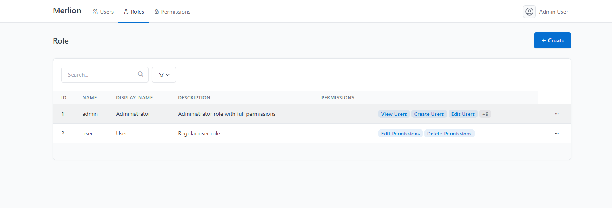
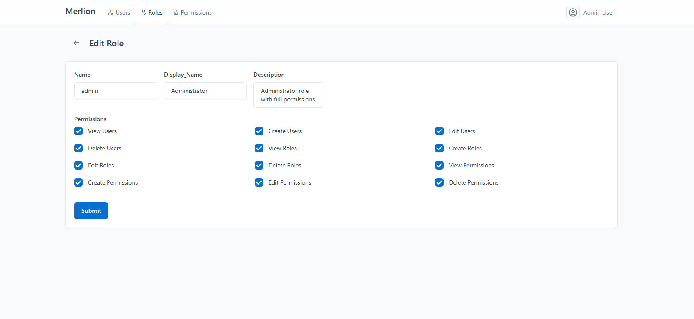
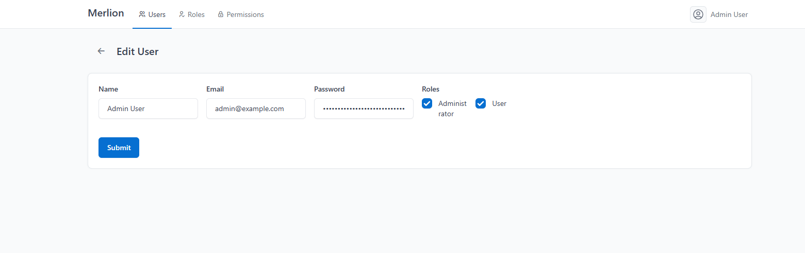

# Merlion Demo

这是一个基于 Laravel 和 Merlion 包构建的后台管理系统演示项目，实现了用户、角色和权限的完整 CRUD 功能。

## 功能特性

- 用户管理 (Users)
- 角色管理 (Roles) 
- 权限管理 (Permissions)
- 自定义表单项 (Custom Checkbox Field)
- 响应式后台界面

## 技术栈

- Laravel 12.x
- Merlion 后台管理包
- MySQL/SQLite 数据库
- Bootstrap UI 框架

## 安装步骤

1. 克隆项目：
```bash
git clone <repository-url>
cd merlion-demo
```

2. 安装依赖：
```bash
composer install
npm install
```

3. 配置环境：
```bash
cp .env.example .env
php artisan key:generate
```

4. 数据库迁移：
```bash
php artisan migrate
php artisan db:seed
```

5. 启动服务器：
```bash
php artisan serve
```

## 默认登录账户

- 管理员账户: admin@example.com / password123
- 普通用户: user@example.com / password123

## 自定义功能

项目包含一个自定义表单项 `custom_checkbox`，用于在用户和角色管理中选择多个选项。

## 项目结构

- `app/Http/Controllers/Admin/` - 管理控制器
- `app/Models/` - 数据模型
- `app/Forms/` - 自定义表单组件
- `resources/views/components/form/` - 自定义表单视图
- `app/Providers/` - 服务提供者




